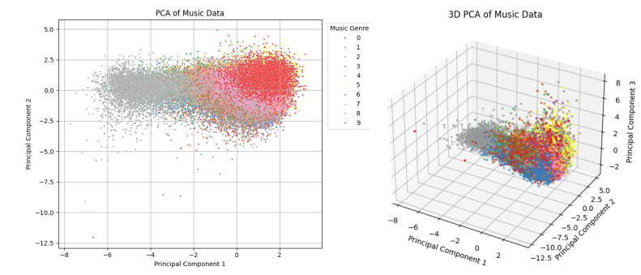
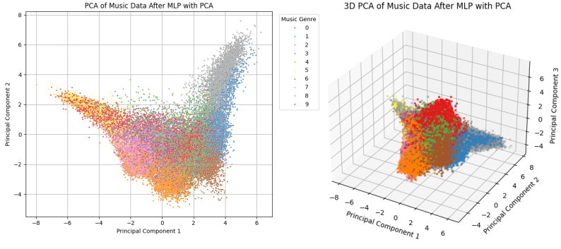

# Spotify-Music-Genre-Classification


## Overview

​	The goal of this project is to develop a multi-class classification model that predicts the genre of a song using the audio features provided by Spotify, such as ‘popularity’, ‘key’, and ‘tempo’. The final model reaches an AUC of **0.9413**.

**PCA data scattering before training:**



**PCA data scattering after training (in latent space):**




## What was Done

- **Data Cleaning and Preprocessing**

- **Dimensionality Reduction**
- **Modeling**
- **Untrained Data and Latent Space Visualization**

**Note: To be more specific and clearer, see report.pdf**


## Implementations

**First, setup the environment by running** 

```
git clone https://github.com/Ruian7P/Spotify-Music-Genre-Classification.git
conda create -n smgc python=3.9
conda activate smgc
pip install -r requirements.txt
```


**To train the model, run**

```
python train.py
```

**with args:**

1. `--model`: mandatory, choices between ["mlp", "resnet", "adaboost", "randomforest"]
2. `--data_path`: default "./musicData.csv"
3. `--use_pca`:  if set, use PCA processed data to train the model
4. `--plot_before`: if set, plot the features with PCA before training
5. `--plot_after`: if set, plot the features with PCA after training


**To use the model, run**

``` 
python main.py
```

**with args (all required):**

1. `--popularity`: float
2. `--acousticness`: float
3. `--danceability`: float
4. `--duration_ms`: float
5. `--energy`: float
6. `--instrumentalness`: float
7. `--liveness`: float
8. `--loudness`: float
9. `--speechiness`: float
10. `--tempo`: float
11. `--valence`: float
12. `--key`: str with choices ["A", "A#", "B", "C", "C#", "D", "D#", "E", "F", "F#", "G", "G#"]
13. `--mode`: str with choices ["Major", "Minor"]

example:
```
python main.py --popularity 50 --acousticness 0.3 --danceability 0.7 --duration_ms 180000 \
--energy 0.8 --instrumentalness 0.0 --liveness 0.1 --loudness -5.0 --speechiness 0.05 \
--tempo 120.0 --valence 0.6 --key C --mode Major
```


